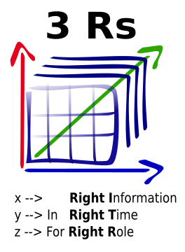

  
  &nbsp;
  

  

<h1 align="center">🌐 SystemThinking.sk</h1>

# System Thinking in IT

Welcome to my personal space focused on system thinking, education, and context-aware methodologies.

➡️ Explore the section:

- [System Thinking Course](class_SystemThinkingInIT/index.md)
